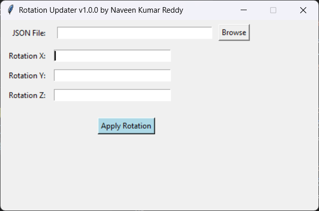
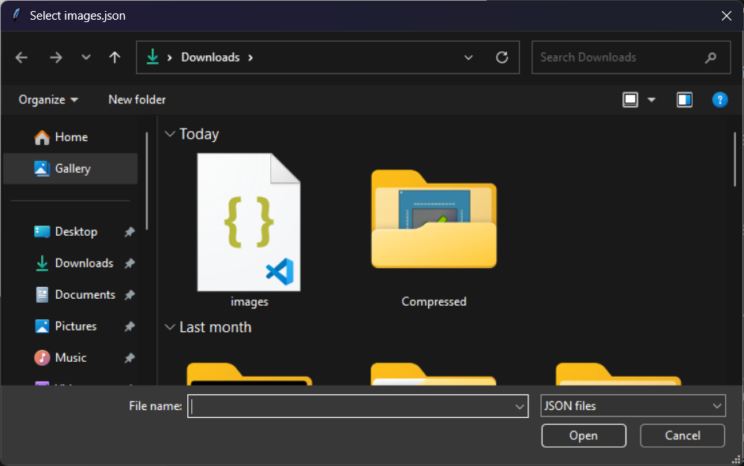
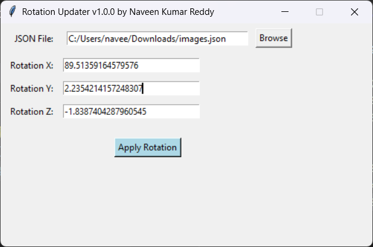
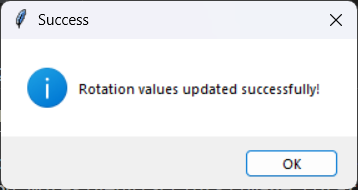

# 🌀 RotationUpdater v1.0.0

A simple Python GUI tool to update all `360 images rotation` values in deeply nested `images.json` files.

> Developed by **P. Naveen Kumar Reddy**

---

## 📜 Features

* Easy-to-use Tkinter GUI
* Select and update `images.json` with new rotation values
* Detects and replaces all list-type `rotation` keys recursively
* Handles complex nested JSON structures
* Shows user-friendly error and success popups

---

## 📅 Installation

### 1. Clone the repository

```bash
git clone https://github.com/NaveenKumarReddy21/360-images-Rotation-Updater.git
cd 360-images-Rotation-Updater

```

### 2. Ensure Python is installed

Verify Python 3.x is available:

```bash
python --version
```

### 3. Install dependencies (if any)

This tool uses Python standard libraries, but for future compatibility:

```bash
pip install -r requirements.txt
```

> On Linux systems, you may need to install `tkinter` manually:

```bash
sudo apt-get install python3-tk
```

---

## 💥 Screenshots

### Main UI



### File Selected



### Rotation Applied



### Success Message



---

## ⚙️ How to Use

1. Run the script:

```bash
python rotation_updater.py
```

2. In the GUI:

   * Click **Browse** to choose your `images.json`
   * Enter new X, Y, Z rotation values
   * Click **Apply Rotation**

3. The tool will recursively search for and update all `rotation` arrays in the file.

---

## 📁 Project Structure

```
RotationUpdater/
├── rotation_updater.py
├── requirements.txt
├── README.md
├── screenshots/
│   ├── main_ui.png
│   ├── file_selected.png
│   ├── rotation_applied.png
│   └── success_message.png
└── .github/
    └── workflows/
        └── python-lint.yml
```

---

## 🖒 What's Coming Next?

* Preview JSON content before updating
* Dark mode theme
* Drag-and-drop JSON file support
* Custom rotation key input
* 📆 One-click `.exe` builder with PyInstaller
* 🚀 Automatic release packaging via GitHub Actions

---

## 🤖 GitHub Actions (CI/CD)

This project uses GitHub Actions to check for Python syntax errors on every push:

```yaml
# .github/workflows/python-lint.yml
python -m py_compile rotation_updater.py
```

✅ Helps catch bugs early and maintain clean code.

---

## 📝 Feedback

Have a suggestion or found a bug?

* 📧 Email: [naveenreddy.puthi@gmail.com](mailto:naveenreddy.puthi@gmail.com)
* 📝 Open an issue: [GitHub Issues](https://github.com/NaveenKumarReddy21/360-images-Rotation-Updater/issues)
* ⭐ Star the repo if it helped you!

---

## 👨‍💼 Developer

**P. Naveen Kumar Reddy**
📧 [naveenreddy.puthi@gmail.com](mailto:naveenreddy.puthi@gmail.com)
📍 Hyderabad, India

---

## 📄 License

This project is licensed under the [MIT License](LICENSE).
